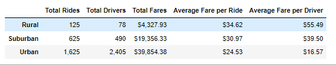
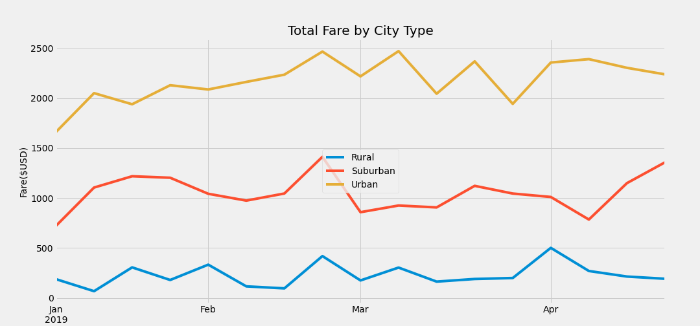

# PyBer Analysis

## Overview of The Analysis

 The purpose of the new analysis is to first, organize the data by city type and create a dataframe that holds a summary of the total rides, total drivers, total fares, average fare per ride, and the average fare per driver. Secondly, the purpose of the new analysis is to organize the data by dates and show the total weekly fares for each city type. The data was then placed into a multi-line graph. 

 ## Results

 ### PyBer Summary Dataframe:

 

 Differences: 
 
 1. Urban areas had a significantly larger number of total rides and total drivers. But, this is the only city type that had more drivers than total rides. This resulted in a higher total fare; However, the average fare per driver was significantly lower than the other two city types. 
 2. Rural areas had much lower total rides and total drivers, but resulted in much higher fares per ride and driver. 
 3. Suburban areas fell more into the middle of the 3 city types and their average fare per ride and driver showed the same. 

### Fares by Week

 PyBer Summary Analysis

 1. All three city types reach a peak season towards the end of February, then come back down in March.
 2. The Urban cities experience more of a fluctuation having multiple peak seasons from the first one in February and again in the beginning of March, middle of March, and beginning of April. 
 3. Rural cities experience one other peak season in April.
 4. For Suburban cities after the peak in late February, they have another peak in the end of April. 

 ## Summary

 1. The results of the PyBer Summary Dataframe indicate that there are significantly more drivers than total rides within Urban cities. I would suggest investing in some advertisement strategies to help balance the number of total drivers and rides.
 2. The PyBer graph reveals multiple peak seasons for PyBer usage. If advertisement is a next step for the PyBer company, I would suggest advertising more heavily during these peak seasons, again, especially in Urban Cities. The peak season for Urban cities are: end of February, beginning of March, middle March, and beginning of April. 
 3. Although Rural cities produce the least amount of total income, the average fare is signifiantly higher than the other two city types. Creating marketing strategies within the rural areas that could even slightly increase total tides, would make a big impact in toal fares. Therefore, it may be worth investing in advertisement strategies that work well in rural areas. 